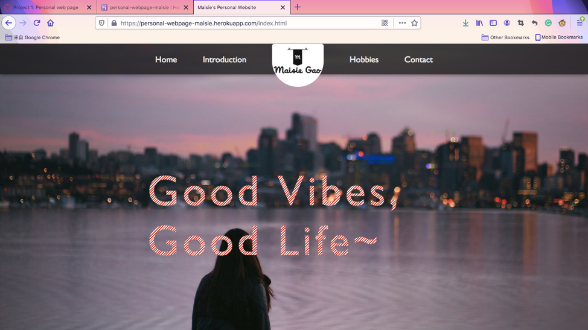
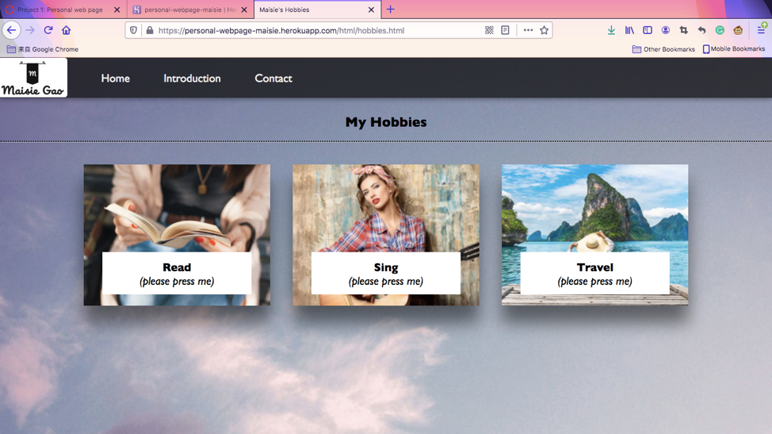
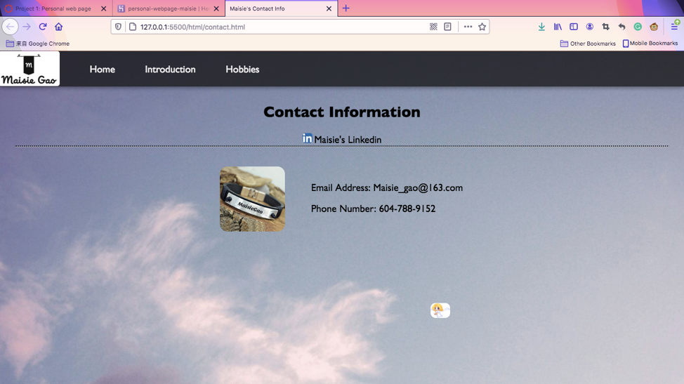

My site is my personal introduction site. It includes four pages/htmls: the home page, my professional introduction page, my hobbies page, and my contact information page.

Screenshots for them:

My landing/top page is defined in index.html. 

I created a header bar on the top of each html in which contain internal links to navigate to other htmls. There is no dead end and each page is accessible through other pages. The logo on the navigation bar also is a link back to the home page. The styling of the pages are matched. The internal links open the content in the same browser tab. The navigation bar is freezed on the top and won't move when the page moves.

There are two external links: The first one is in the hobbies page. When user hover the mouse on the white box(which states:please click me) of the travel picture, the paragraph with the link will appear. The user can click the pink word "here" and it will direct the user to an external website called travelsites.com. The second external link is on contact page where it said Maisie’s Linkedin. The user can click either the icon or the words "Maisie's Linkedin" to open the linkedin page of mine.

There is one table on the contact page that lists my email and phone number. I used CSS to make it look nice.

There are two interactive components that I used jQuery to create. The first one is in the hobbies page. When user’s mouse is hovered on one of three photos, the other two photos that the mouse is not on would become dark. If the mouse is on none of the photos, the photos are in its normal brightness (which means 100% bright). The second one is on the contact page. When the mouse is below the line of demarcation below the linkedin link, there appears an angle photo that moves together with the mouse.

The pages are responsive as well. The pages looks okay on different sized displays with minor changes of style.

All the pages has its own .html file. All the CSS files are in a subdirectory called css and all the javascript files are in a subdirectory called javascripts.
I have only used HTML, CSS, vanilla JavaScript, and jQuery to complete this project. No other third party dependencies have been used.

The link to my project on Heroku:
https://personal-webpage-maisie.herokuapp.com/
  

